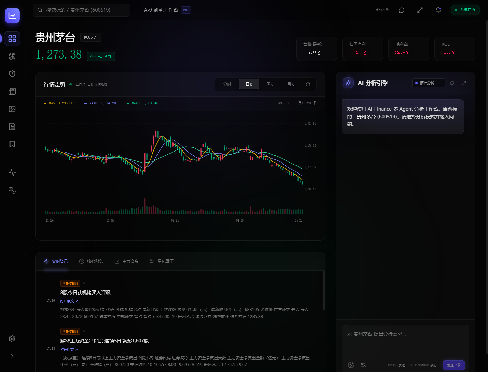
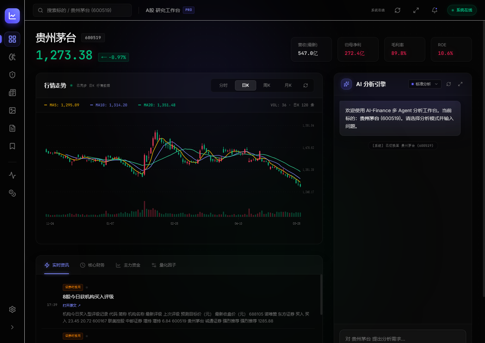
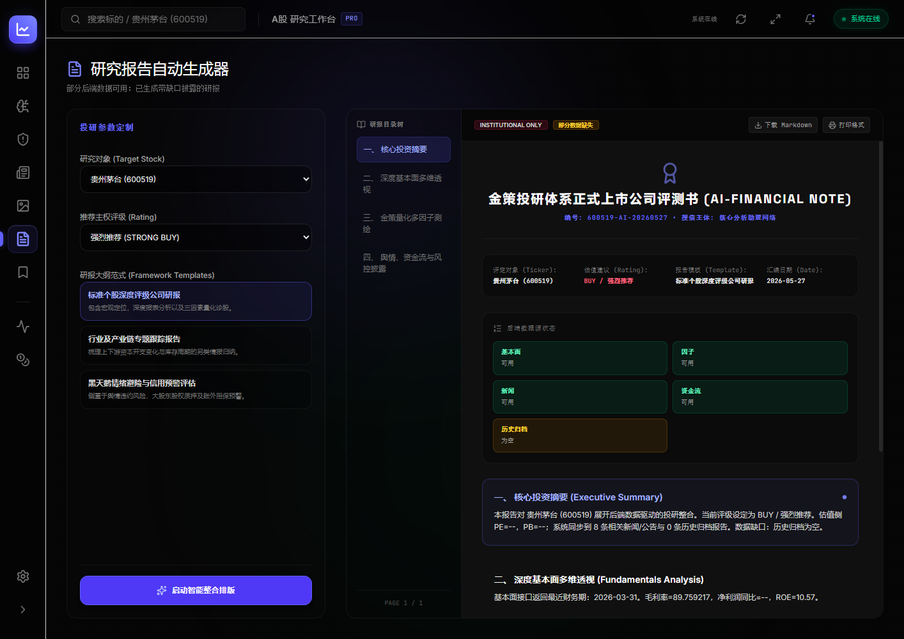

# 研策中枢 AlphaScope｜AI 投研与本地量化决策工作台

[](https://github.com/TIANWEN-cpu/AI--FINANCE/actions/workflows/ci.yml)
[](https://www.python.org/)
[](apps/web/package.json)
[](docs/api.md)
[](tests)
[](LICENSE)
[](https://github.com/TIANWEN-cpu/AI--FINANCE/releases/tag/v1.5.0)

研策中枢 AlphaScope 是一个本地优先的 AI 投研与量化决策工作台。项目把行情、新闻、公告、财务指标、技术分析、多 Agent 研究、证据链、研究报告、量化回测、基金定投和组合管理整合到一个可运行、可测试、可扩展的工程系统中。

它的目标不是给出不可追溯的“单句结论”，而是提供一套可审计的研究流程：多模型协同分析、数据源状态透明、证据可追踪、结果可复核。

> 免责声明：本项目用于研究、学习和辅助分析，不构成投资建议。任何输出都应结合真实数据源、个人风险承受能力和专业判断独立核验。

## 目录

- [核心能力](#核心能力)
- [系统特点](#系统特点)
- [架构概览](#架构概览)
- [快速开始](#快速开始)
- [功能模块](#功能模块)
- [API 概览](#api-概览)
- [开发与验证](#开发与验证)
- [项目结构](#项目结构)
- [版本历史](#版本历史)
- [已知边界](#已知边界)

## 核心能力

### Multi-Agent 投研编排

- 支持标准、深度、自动等分析模式。
- 多角色 Agent 并行工作，覆盖基本面、技术面、舆情、风控、资金行为等视角。
- Critic / Chairman 层用于交叉检查、汇总结论和降低单模型过度自信。
- 后端运行时会读取托管 Agent 配置，前端启用/禁用会影响实际调度。

### 证据驱动的研究输出

- 分析结果尽量关联新闻、公告、行情、资金流、因子、报告和 Agent 输出。
- 报告生成会展示数据源成功、失败、为空的状态。
- 本地模板、演示样本、暂未接入能力会在界面中明确标注。
- 不用静态样本伪装真实后端结果。

### 现代化 Web 工作台

- `apps/web` 使用 Vite + React 19 构建。
- 支持股票搜索、工作台联动、多 Agent 网络、K 线/多模态、资讯聚合、报告生成、证据链、组合风控、量化回测、基金定投和设置中心。
- SSE 流式对话已接入前端状态、错误和 Agent 输出。
- Provider、Agent、行情、新闻、报告、回测等关键交互接入真实后端接口。

### 本地安全与配置管理

- Provider API Key 由后端加密保存。
- 前端不回显明文密钥，只显示脱敏占位。
- Provider 保存响应不会返回 plaintext `api_key`。
- 日志和错误输出包含脱敏处理，适合本地研究或内网部署。

### 工程化与可扩展性

- FastAPI 后端提供 100+ REST / SSE 接口。
- 数据源采用 Provider 插件化设计，可扩展行情、新闻、公告、研报、宏观和自定义数据源。
- 后端核心路径有测试覆盖，当前主分支验证状态为 `886 passed, 2 skipped`。
- 保留 Streamlit 调试台，便于快速实验和诊断。

## 界面预览

### 股票工作台



### 数据源终端



### 研究报告生成



## v1.5.0 前端工作台更新

v1.5.0 聚焦 React 工作台的可用性、新闻研究流和多 Agent 配置体验。新闻模块补齐详情阅读、原文跳转和 AI 助手；专家团配置迁移到系统设置；当前前端包整理为可独立运行和验证的 Vite 应用。

### 新闻研究流

- 新闻模块新增详情查看能力，可在弹层中查看正文、来源、分类、影响、情绪和 AI 摘要。
- 每条新闻提供原文打开能力；无真实 `sourceUrl` 时会降级为按标题、标的和来源发起的搜索跳转。
- 新增新闻 AI 助手，支持选中新闻后提问，也支持输入新闻链接进行解析；后端接口不可用时会返回待核验解析卡片。
- 新闻源概览改为可收起，避免挤占新闻列表空间。

### Agent 编排与系统设置

- Agent 数量、启用状态、名称、角色、职责说明、系统提示词、模型、温度和图标统一迁移到系统设置的“Agent 编排”页签。
- 专家圆桌页回归运行监控视图，只展示席位状态、运行任务、拓扑和跳转设置入口。
- 启用的 Agent 配置会写入分析请求的 `agent_configs` 字段，供后端调度使用。
- Agent 配置保存在浏览器本地，刷新后保留。

### 品牌与界面整理

- 清理当前前端可见品牌残留和旧内部代号文案。
- 系统设置页增加 Agent 编排，避免在专家圆桌页出现过重的编辑抽屉。
- 前端包名和元信息更新为正式工作台发布形态。

### 本地实测状态

- `npm run lint` 通过。
- `npm run build` 通过，仅保留 Vite chunk size warning。
- 本地页面 `http://127.0.0.1:3002/` 可达，Agent 设置迁移路径经过烟测。

## v1.4.2 修复更新

v1.4.2 是品牌迁移与本地体验稳定性补丁。项目正式更名为 **研策中枢 AlphaScope**；同时修复真实浏览器体验中暴露的本地回测、新闻模块和系统设置问题。

### 品牌与仓库迁移

- README、前端 README、用户手册和部署文档的项目名迁移为研策中枢 AlphaScope。
- CI、Release、clone、Issues 链接完成统一校准。
- Release workflow 默认发布标签更新为 `v1.4.2`。

### 本地体验稳定性

- 本地回测运行前会自动刷新 `/api/quant/status` 与 `/api/quant/strategies`，避免后端重启后按钮卡死。
- 新闻模块刷新失败时保留上次成功结果，并提供“重新同步”入口。
- 新闻出库层修复历史 UTF-8/latin1 乱码字段，资讯标题、摘要和来源恢复正常中文。
- 系统设置新增 `/api/settings/preferences` GET/PUT 接口，基础设置、网络节点、安全组、数据管理页签接入真实持久化。

### 本地实测状态

- 前端 `npm run lint` 通过。
- 后端定向回归 `tests/test_settings.py tests/test_quant_api.py tests/test_news_store.py` 共 `52 passed`。
- 浏览器复测覆盖本地回测运行、新闻中文展示、设置保存与刷新持久化。

## v1.4.1 修复更新

v1.4.1 是 v1.4 前端工作台的稳定性补丁，重点解决运行实测中暴露的资金流、量化因子和研报交互问题。

### 资金流与量化因子稳定性

- 个股主力资金流改为带超时的东方财富直连源，避免 AkShare 无超时请求导致页面长期等待。
- 成功数据会写入本地缓存；上游临时不可用时返回缓存数据并明确标记降级。
- `/api/fund-flow/{symbol}` 会返回真实 `source/source_status/degraded/cached_at` 元数据。
- 量化因子会区分“缓存降级”和“维度缺失”，缓存可用时不再把资金流误判为缺失维度。
- Workbench 资金卡片会区分真实数据、缓存数据和降级空态，避免把可用缓存显示成空值。

### 研报和前端可用性

- 研报目录改为显式滚动正文容器，目录按钮在嵌套滚动布局中更稳定。
- 研报生成页修正文案、下载按钮和边框样式。
- 脱敏历史计划文档中的测试 API Key 字符串，避免测试密钥残留在仓库内容中。

### 本地实测状态

- `/api/fund-flow/600519?days=30` 返回 30 条 Eastmoney 资金流记录，`degraded=false`。
- `/api/factors/600519` 返回资金流因子，`degraded_inputs=[]`，`missing_dimensions=[]`。
- 前端 `npm run lint` 和 `npm run build` 通过，仅保留 Vite chunk size warning。

## 系统特点

| 特点 | 说明 |
|------|------|
| Local-first | 默认本地运行，密钥、数据库、报告和上传文件保存在本机目录 |
| Multi-agent | 多模型、多角色协同，避免完全依赖单一模型输出 |
| Evidence-first | 结果尽量附带来源、证据、数据状态和失败原因 |
| API-first | FastAPI 提供统一后端契约，前端和脚本都可复用 |
| Extensible | Provider、Agent、量化策略、报告模板均可扩展 |
| Testable | 后端契约、设置安全、SSE、运行时编排、量化/基金逻辑均有测试 |

## 架构概览

```text
┌─────────────────────────────────────────────────────────────┐
│ Data Providers                                               │
│ Prices · News · Announcements · Fundamentals · Funds · Macro │
└──────────────────────────┬──────────────────────────────────┘
                           ▼
┌─────────────────────────────────────────────────────────────┐
│ Data Quality & Storage                                       │
│ SQLite · Report Archive · Evidence Store · Source Status     │
└──────────────────────────┬──────────────────────────────────┘
                           ▼
┌─────────────────────────────────────────────────────────────┐
│ Analysis Runtime                                             │
│ Multi-Agent Orchestrator · Tool Router · Critic · Chairman   │
└──────────────────────────┬──────────────────────────────────┘
                           ▼
┌─────────────────────────────────────────────────────────────┐
│ FastAPI Service Layer                                        │
│ REST APIs · SSE Streaming · Settings · Quant · Funds         │
└──────────────────────────┬──────────────────────────────────┘
                           ▼
┌─────────────────────────────────────────────────────────────┐
│ User Interfaces                                              │
│ Vite React Workbench · Streamlit Console · Docker/Local CLI  │
└─────────────────────────────────────────────────────────────┘
```

## 快速开始

### 环境要求

- Python 3.11 或 3.12
- Node.js 20+
- 至少一个可用的大模型 API Key，建议先配置 DeepSeek
- Windows、Linux、macOS 均可运行

### 1. 克隆项目

```bash
git clone https://github.com/TIANWEN-cpu/AI--FINANCE.git
cd AI--FINANCE
```

### 2. 安装后端依赖

```bash
pip install -r requirements.txt
cp .env.example .env
```

编辑 `.env`，填入自己的模型和数据源 Key。最小配置示例：

```env
DEEPSEEK_API_KEY=your_api_key
```

### 3. 启动 FastAPI 后端

```bash
uvicorn backend.api.main:app --host 0.0.0.0 --port 8000
```

启动后可访问：

- Health Check: `http://localhost:8000/health`
- API Docs: `http://localhost:8000/docs`

### 4. 启动 Web 前端

```bash
cd apps/web
npm install
npm run dev
```

默认访问：`http://localhost:3000`

### 5. Windows 脚本启动

```bash
scripts\start_local.bat
```

### 6. Docker 启动

```bash
cp .env.example .env
docker-compose up -d
```

默认服务：

- FastAPI: `http://localhost:8000`
- Web: `http://localhost:3000`
- Streamlit: `http://localhost:8501`

## 功能模块

| 模块 | 能力 |
|------|------|
| 对话式研究 | SSE 流式输出、多模式分析、多 Agent 协同 |
| 股票工作台 | 行情、新闻、资金流、因子、基本面和图表聚合 |
| 多 Agent 网络 | Agent 查看、启用/禁用、托管配置同步 |
| 数据源终端 | 新闻、公告、事件、市场参考信息和数据状态展示 |
| K 线/多模态 | K 线、均线、成交量、MACD/RSI、图像上传分析 |
| 研究报告 | 数据源质量检查、报告生成、缺失项提示 |
| 证据链 | 跟踪新闻、公告、行情、报告和 Agent 结论来源 |
| 组合与风控 | 组合、持仓、风险指标、再平衡接口 |
| 量化回测 | 策略列表、参数配置、回测执行、运行记录 |
| 基金定投 | 基金搜索、净值、指标、定投模拟、计划管理 |
| 设置中心 | Provider 管理、API Key 加密保存、连接测试、模型列表 |

## API 概览

FastAPI 后端覆盖聊天、分析、视觉、行情、新闻、报告、设置、Agent、量化和基金等模块。常用接口：

| 能力 | 代表接口 |
|------|----------|
| 健康检查 | `GET /health` |
| SSE 对话 | `POST /api/chat/stream` |
| 分析任务 | `POST /api/analysis/run`, `POST /api/analysis/async` |
| 多模态分析 | `POST /api/vision/analyze` |
| Agent 管理 | `GET /api/agents`, `GET/POST /api/manage/agents` |
| Provider 设置 | `GET/POST /api/settings/providers`, `POST /api/settings/providers/{id}/test` |
| 行情数据 | `GET /api/prices/{symbol}/latest`, `POST /api/prices/{symbol}/fetch` |
| 新闻公告 | `GET /api/news`, `GET /api/news/announcements`, `GET /api/news/{id}` |
| 报告归档 | `GET /api/archive`, `GET /api/archive/{path}` |
| 量化回测 | `GET /api/quant/strategies`, `POST /api/quant/backtest`, `GET /api/quant/runs` |
| 基金研究 | `GET /api/funds/search`, `GET /api/funds/{code}/nav`, `POST /api/fund-dca/simulate` |
| 组合管理 | `GET/POST /api/fund-portfolio`, `POST /api/fund-portfolio/rebalance` |

完整接口请启动后端后查看 `http://localhost:8000/docs`。

## 开发与验证

### 后端

```bash
python -m pytest tests/ -q
ruff check backend frontend tests
ruff format --check backend frontend tests
```

### 前端

```bash
npm --prefix "apps/web" run lint
npm --prefix "apps/web" run build
```

说明：前端类型检查使用 `tsc --noEmit`，不要用 Ruff 检查 `.ts` / `.tsx` 文件。

### 当前主分支验证状态

- Targeted regression: `52 passed`
- Python lint: `ruff check` 通过
- Python format: `ruff format --check` 通过
- Web lint: `tsc --noEmit` 通过
- Web build: Vite build 通过，仅存在 chunk size warning

## 项目结构

```text
backend/                # FastAPI 后端
├── api/                # REST / SSE 接口
├── runtime/            # 多 Agent 编排与模式路由
├── providers/          # 数据源插件
├── agents/             # Agent 定义与提示词
├── funds/              # 基金、定投、组合逻辑
├── quant/              # 量化策略、回测、组合和风控逻辑
├── vision/             # 图片和 K 线分析
├── storage/            # SQLite 存储
├── security/           # 密钥加密、脱敏和安全工具
└── settings_store.py   # Provider 与系统偏好设置持久化

apps/web/               # Vite React 主前端
frontend/               # Streamlit 调试台
config/                 # YAML 配置
prompts/                # 提示词模板
scripts/                # 启动、迁移、检查脚本
tests/                  # 后端测试与契约测试
docs/                   # 架构、API、部署和用户文档
data/                   # 本地运行数据，默认 gitignore
```

## 版本历史

| 版本 | 日期 | 重点 |
|------|------|------|
| v1.5.0 | 2026-05-30 | 新闻详情与新闻 AI 助手、Agent 编排迁移到系统设置、分析请求携带 agent_configs、前端品牌与发布文档整理 |
| v1.4.2 | 2026-05-28 | 品牌迁移为研策中枢 AlphaScope、本地回测自恢复、新闻乱码与降级体验修复、系统设置偏好持久化 |
| v1.4.1 | 2026-05-27 | 主力资金改用带超时 Eastmoney 源、缓存降级、资金流因子修复、研报目录滚动与 README 截图 |
| v1.4.0 | 2026-05-25 | Vite React 工作台、股票搜索联动、SSE 契约修复、Provider 密钥安全、多 Agent 托管配置、新闻/报告/回测真实状态标注 |
| v1.3 | 2026-05-23 | 量化回测适配、基金/定投/组合模块、ToolRouter 10 工具、113 API、793 tests |
| v1.2 | 2026-05-23 | 前端功能补全：Settings CRUD、Expert 圆桌、TaskCenter、成本统计、模型自动拉取 |
| v1.1 | 2026-05-22 | 前端重构：深色工作台、K 线 SVG、资讯/财务/资金流/因子、SSE AI 面板 |
| v1.0.1 | 2026-05-22 | 性能优化与安全加固：缓存、并行 provider、日志脱敏、error boundary |
| v1.0 | 2026-05-21 | Local 正式版：一键启动、主工作台、专家团、K 线、报告、备份、697 tests |

## 已知边界

- 本项目是研究和辅助分析工具，不提供确定性买卖建议。
- 外部数据源可用性取决于用户配置、网络环境、第三方接口稳定性和授权限制。
- 部分宏观日历、市场参考信息和模板问答属于演示或参考内容，界面会明确标注。
- 个别功能仍处于工程演进阶段，例如更细粒度的前端代码分包、更多端到端测试和更完善的数据源降级策略。

## 文档

- [本地快速开始](docs/local-quickstart.md)
- [用户手册](docs/user-manual/README.md)
- [系统架构](docs/architecture.md)
- [API 文档](docs/api.md)
- [前后端契约](docs/contract.md)
- [部署指南](docs/deployment.md)
- [Agent 设计](docs/agent-design.md)
- [安全说明](docs/security.md)

## License

MIT
