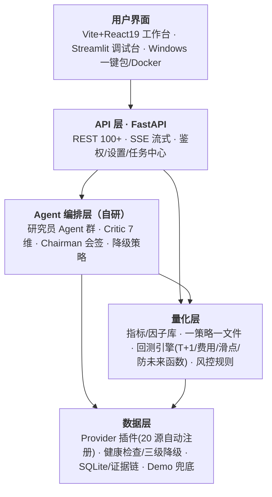

# 研策中枢 AlphaScope｜AI 投研与本地量化决策工作台

[](https://github.com/TIANWEN-cpu/AlphaScope/actions/workflows/ci.yml)
[](https://www.python.org/)
[](apps/web/package.json)
[](docs/api.md)
[](tests)
[](LICENSE)
[](https://github.com/TIANWEN-cpu/AlphaScope/releases)

> **把 AI 选股从「黑箱结论」变成「可复核的研究流程」。**
>
> AlphaScope · 研策中枢是一个本地优先的**私人投研委员会**：多分析师辩论、风控一票否决、每个结论都能溯源。
> Local-first AI equity research, fully auditable — multi-agent debate, evidence chain, backtesting with real trading frictions.

研策中枢 AlphaScope 把行情、新闻、公告、财务指标、技术分析、多 Agent 研究、证据链、研究报告、量化回测、基金定投和组合管理整合到一个**可运行、可测试、可扩展**的工程系统中。它的目标不是给出不可追溯的“单句结论”，而是提供一套**可审计的研究流程**：多模型协同分析、数据源状态透明、证据可追踪、结果可复核。

> 免责声明：本项目用于研究、学习和辅助分析，**不构成投资建议，不荐股、不预测行情、不承诺收益**。任何输出都应结合真实数据源、个人风险承受能力和专业判断独立核验。本项目**不具备证券投资咨询资质**，不提供实盘交易 / 自动下单能力。

---

## ✨ 5 分钟黄金路径

不用读文档，从启动到导出第一份研报 ≤ 5 分钟、≤ 6 次点击：

```
搜股票 → 工作台(行情/新闻/公告) → AI 研报(多 Agent 辩论) → 证据链(结论反查来源) → 简单回测 → 导出报告
```

> 🎬 **演示 GIF 占位**：`docs/assets/v1.9.0/golden-path.gif`（待录制：搜「茅台」→生成研报→点证据链→跑双均线回测→导出。建议 60s、≤ 5MB）

### 两行启动

```bash
# 推荐：Windows 一键安装包（无需 Python/Node，下载即用）
#  → https://github.com/TIANWEN-cpu/AlphaScope/releases

# 或源码启动
pip install -r requirements.txt && uvicorn backend.api.main:app --port 8000   # 后端
cd apps/web && npm install && npm run dev                                       # 前端 → http://localhost:3000
```

### 🧪 先用 Demo 体验（零 Key）

不想配置 API Key？首次启动时在引导弹窗点「**先用 Demo 体验**」，即可用内置 10 只股票示例数据走完整条研究流程，研报会明确标注「演示样本」。准备好后再到「设置」里填自己的 Key 切换真实分析。

---

## 🎯 明确不做（克制定位）

| 不做 | 原因 |
|------|------|
| ❌ **不荐股 / 不预测涨跌** | 只做研究、回测与决策支持，结论需人工复核 |
| ❌ **不承诺收益** | 回测页显著标注「不代表未来收益」，不出现「年化 X%」营销话术 |
| ❌ **不接实盘 / 自动下单** | 合规红线（无投顾资质），明确不做反而是合规优势 |
| ❌ **不用静态样本伪装真实后端结果** | 证据驱动：数据源状态透明，演示样本明确标注 |

## 🧭 架构一览



> 完整分层与数据流见 [架构概览](#架构概览) 与 `docs/architecture.md`。

## 界面预览

> 📸 截图录制中：`docs/assets/v1.9.0/`（当前文档引用的是 v1.4.1 历史截图，v1.9.0 截图待更新）。

### 股票工作台


### 数据源终端


### 研究报告生成


## 目录

- [核心能力](#核心能力)
- [系统特点](#系统特点)
- [架构概览](#架构概览)
- [快速开始](#快速开始)
- [功能模块](#功能模块)
- [API 概览](#api-概览)
- [开发与验证](#开发与验证)
- [项目结构](#项目结构)
- [版本历史](#版本历史)
- [已知边界](#已知边界)

## 核心能力

### Multi-Agent 投研编排

- 支持标准、深度、自动等分析模式。
- 多角色 Agent 并行工作，覆盖基本面、技术面、舆情、风控、资金行为等视角。
- Critic / Chairman 层用于交叉检查、汇总结论和降低单模型过度自信。
- 后端运行时会读取托管 Agent 配置，前端启用/禁用会影响实际调度。

### 证据驱动的研究输出

- 分析结果尽量关联新闻、公告、行情、资金流、因子、报告和 Agent 输出。
- 报告生成会展示数据源成功、失败、为空的状态。
- 本地模板、演示样本、暂未接入能力会在界面中明确标注。
- 不用静态样本伪装真实后端结果。

### 现代化 Web 工作台

- `apps/web` 使用 Vite + React 19 构建。
- 支持股票搜索、工作台联动、多 Agent 网络、K 线/多模态、资讯聚合、报告生成、证据链、组合风控、量化回测、基金定投和设置中心。
- SSE 流式对话已接入前端状态、错误和 Agent 输出。
- Provider、Agent、行情、新闻、报告、回测等关键交互接入真实后端接口。

### 本地安全与配置管理

- Provider API Key 由后端加密保存。
- 前端不回显明文密钥，只显示脱敏占位。
- Provider 保存响应不会返回 plaintext `api_key`。
- 日志和错误输出包含脱敏处理，适合本地研究或内网部署。

### 工程化与可扩展性

- FastAPI 后端提供 100+ REST / SSE 接口。
- 数据源采用 Provider 插件化设计，可扩展行情、新闻、公告、研报、宏观和自定义数据源。
- 后端核心路径有测试覆盖，当前主分支验证状态为 `886 passed, 2 skipped`。
- 保留 Streamlit 调试台，便于快速实验和诊断。

## 版本里程碑

> 完整逐版更新见 [`CHANGELOG.md`](CHANGELOG.md)。下面只列主线里程碑（把 68 个补丁式 Release 收敛成 4 个阶段故事）。

| 里程碑 | 一句话 |
|--------|--------|
| **v1.9.x 可信度 + 零门槛** | 回测补齐 A 股真实交易摩擦（T+1/印花税/滑点/防未来函数）；Demo 零 Key 模式让上手 < 5 分钟；策略库重构为一策略一文件 + 自动发现 |
| **v1.7–1.8 工程稳定与一键交付** | Windows 一键安装包、K 线周期稳定、上传安全、分析真实性约束（空数据不再伪装成功）、付费数据源接入 |
| **v1.6 前端工作台成型** | 新闻研究流、专家团迁移到系统设置、自定义 OpenAI-compatible Provider、研报结构化正文 |
| **v1.4 品牌迁移** | 正式更名为「研策中枢 AlphaScope」，仓库/CI/Release 链路统一 |

<details>
<summary><b>📜 早期补丁日志（v1.4.1 – v1.7.4，点击展开）</b></summary>

## v1.7.4 年K与自定义周期

v1.7.4 在 v1.7.3 的周期横轴修复之上继续增强股票工作台：新增真正的年K聚合，并提供自定义 K 线周期选择。

### 本次修复

- 新增 `年K` 周期按钮，前端请求 `frequency=1y`，后端按自然年从日线聚合 OHLC、成交量和成交额。
- 新增 `自定义` 周期入口，可选择 `分时 / 日K / 周K / 月K / 年K` 粒度，并按粒度选择窗口大小。
- 年K横轴显示年份；月K仍显示月份，标签抽样不再被误解为“半年K”。
- Browser-Use 实测通过：年K横轴显示 `2024 / 2025 / 2026`，自定义年K显示 `年K / 10年` 并返回同样的年度刻度。

## v1.7.3 K 线周期日期联动修复

v1.7.3 是 v1.7.2 之后的 K 线体验补丁，重点修复股票工作台里 `分时 / 日K / 周K / 月K` 周期切换后，底部横轴日期粒度没有与当前周期稳定对应的问题。

### 本次修复

- 分时 K 线兜底数据改为按分钟生成，横轴显示 `HH:mm`，不再误用连续自然日日期。
- 日K、周K 横轴保持 `MM-DD` 日期格式，月K 横轴显示 `YYYY-MM`。
- Workbench 两处 Recharts XAxis 均按当前 `activePeriod` 格式化，避免主图和成交量图周期显示不一致。
- 横轴按交易周期等距显示，周末和节假日不补空柱，因此相邻标签的自然日跨度可能不同。
- Browser-Use 实测通过：分时显示 `13:01` 至 `15:00`，日K/周K显示日期，月K显示月份，临时验证页 fresh `warn/error=0`。

## v1.7.2 图表稳定与一键启动复验

v1.7.2 是 v1.7.1 之后的打包质量补丁，聚焦最终交付前的浏览器验证：所有 Recharts 图表改为在容器尺寸可用后再以数字宽高渲染，避免首页、组合、回测、K 线/多模态、基金定投等页面在首次布局或页签切换时产生 `width(-1)` / `height(-1)` console warning。

### 本次修复

- 新增 `StableChartContainer`，统一测量图表容器尺寸，并向 Recharts 图表传入稳定数字宽高。
- 替换 Workbench、Portfolio、Backtesting、MultimodalChart、FundDcaLab 中的直接 `ResponsiveContainer` 用法。
- 修复 K 线/多模态页本地预览数据把 48 根 K 线生成为 `05-32`、`05-48` 等非法日期的问题。
- 重新打包 Windows portable 目录与 `AlphaScope-portable.zip`，确认 `_internal/pyproject.toml`、`_internal/akshare/file_fold/calendar.json` 和 Web 静态资源均包含在包内。
- 打包版 `/health` 返回 `1.7.2`，`/api/prices/600519?limit=3` 返回 `success=true`、`source_status=ok`、`degraded=false`。
- Browser-Use 打开最终打包页面后，本次新增 console `warning=0`、`error=0`、Recharts warning `0`。

## v1.7.1 已知问题修复与一键启动交付

v1.7.1 聚焦已知问题收尾：修复通用上传文件名安全、顶部搜索 Enter 误选、所有 Agent 失败仍返回成功、股票池导出不可测试、首屏 Recharts 容器告警和前端 React 类型缺口；同时重新验证 Windows portable 一键启动打包链路。

### 稳定性与安全修复

- 通用 `/api/files/upload` 会规范化文件名，并校验最终保存路径仍位于上传目录内。
- 顶部搜索框按 Enter 会解析用户实际输入，不再误选建议列表第一项。
- `/api/analysis/run` 在所有 Agent 失败时返回 `success=false` 和 `analysis_all_agents_failed`。
- Workbench K 线图使用稳定高度容器，刷新后不再产生 Recharts 容器尺寸告警。
- API 版本号改为读取 `pyproject.toml`，避免健康检查版本与发布版本脱节。

### 导出与一键启动

- 新增 `POST /api/quant/stock-pool/export`，股票池导出可由服务端返回 CSV 下载。
- 回测页导出优先使用服务端 CSV，失败时保留本地导出兜底。
- `python build.py --zip` 可生成 `dist/AlphaScope/AlphaScope.exe` 和 `dist/AlphaScope-portable.zip`。
- Windows 一键启动包已包含 `akshare` 运行时数据文件，打包后 `/health` 返回 `1.7.1`，行情接口可正常返回数据。

### 验证状态

- `python -m pytest tests/test_quant_api.py tests/test_analysis_guardrails.py tests/test_file_upload_safety.py tests/test_upload_safety.py -q` 通过，`20 passed`。
- `python -m ruff check .` 通过。
- `npm run lint` 通过。
- `npm run build` 通过。
- Browser-Use 复验首页行情图可见，刷新后 fresh warn/error console logs 为 `0`。

## v1.7.0 安全与真实性修复

v1.7.0 聚焦后端边界安全和前端真实链路确认：知识库上传不再信任客户端原始文件名，Workbench 上传会等待后端确认后再显示成功，分析接口不再从空行情或零值行情构造正常成功结果；同时为新闻、技术指标和 Provider 模型列表补充资源上限与超时保护。

### 上传与知识库安全

- 知识库上传文件名会先去除路径组件并规范化非法字符，再写入磁盘和元数据。
- 上传保存仍保留内容 hash 前缀，降低同名文件冲突风险。
- Workbench 的材料上传改为真实调用 `/api/knowledge/upload`，失败时显示错误，不再只更新本地 UI 状态。
- 新增上传安全回归测试，覆盖 traversal-style 文件名和规范化文件名路径。

### 分析与资源边界

- `/api/analysis/run` 改为基于真实价格数据构造分析上下文。
- 空行情或零值行情会返回结构化失败，避免后端生成未标注的正常分析成功响应。
- 新闻与技术指标接口增加请求参数上限，防止超大 limit / lookback / days 驱动过量工作。
- Provider 模型列表获取移入 worker thread 并增加超时，避免阻塞 async API 路径。

### 验证状态

- `python -m pytest tests/test_upload_safety.py tests/test_resource_limits.py tests/test_analysis_guardrails.py tests/test_settings.py -q` 通过，`42 passed`。
- `npm run lint` 通过。
- `npm run build` 通过，仅保留既有 Vite chunk size / dynamic import warning。

## v1.6.0 前端工作台更新

v1.6.0 聚焦 React 工作台的可用性、新闻研究流、多 Agent 配置、模型路由和一键安装体验。新闻模块补齐详情阅读、原文跳转和 AI 助手；专家团配置迁移到系统设置；模型 Provider 支持自定义 Base URL / API Key / 模型列表；研报生成、K 线诊断和聊天入口也接入统一模型配置。

### 新闻研究流

- 新闻模块新增详情查看能力，可在弹层中查看正文、来源、分类、影响、情绪和 AI 摘要。
- 每条新闻提供原文打开能力；无真实 `sourceUrl` 时会降级为按标题、标的和来源发起的搜索跳转。
- 新增新闻 AI 助手，支持选中新闻后提问，也支持输入新闻链接进行解析；后端接口不可用时会返回待核验解析卡片。
- 新闻源概览改为可收起，避免挤占新闻列表空间。

### Agent 编排与系统设置

- Agent 数量、启用状态、名称、角色、职责说明、系统提示词、模型、温度和图标统一迁移到系统设置的“Agent 编排”页签。
- 专家圆桌页回归运行监控视图，只展示席位状态、运行任务、拓扑和跳转设置入口。
- 启用的 Agent 配置会写入分析请求的 `agent_configs` 字段，供后端调度使用。
- Agent 配置保存在浏览器本地，刷新后保留。

### 自定义模型与 AI 功能接入

- 系统设置支持添加 OpenAI-compatible Provider，自定义 `base_url`、API Key、模型列表和模型能力标签。
- 聊天、新闻助手、研报生成、专家团、K 线多模态诊断、视觉解析和推理分析可按功能选择模型；默认可一键使用统一模型。
- 支持区分视觉模型、推理模型和嵌入模型，嵌入模型可用于本地知识库。
- 研报生成会显示模型链路状态；当 API Key 或 Provider 鉴权失败时，会生成结构化投研底稿并提示用户回到系统设置修复配置。

### K 线与研报体验

- K 线分析修复上传图像与诊断对象不一致的问题，图像诊断优先针对用户上传内容。
- K 线图补充时间标注、价格信息、涨跌幅提示框和红绿涨跌样式，周 K / 月 K 支持更长历史区间。
- 研报页新增完整研报正文、投委会摘要、市场快照、风控复核、专家会签和模型状态提示，不再把模型错误或 JSON 残片当作报告正文展示。

### 品牌与界面整理

- 清理当前前端可见品牌残留和旧内部代号文案。
- 系统设置页增加 Agent 编排，避免在专家圆桌页出现过重的编辑抽屉。
- 前端包名和元信息更新为正式工作台发布形态。

### 本地实测状态

- `npm run lint` 通过。
- `npm run build` 通过，仅保留 Vite chunk size warning。
- 本地页面 `http://127.0.0.1:3002/` 可达，Agent 设置迁移、K 线提示框、研报生成和模型降级提示经过浏览器烟测。

## v1.4.2 修复更新

v1.4.2 是品牌迁移与本地体验稳定性补丁。项目正式更名为 **研策中枢 AlphaScope**；同时修复真实浏览器体验中暴露的本地回测、新闻模块和系统设置问题。

### 品牌与仓库迁移

- README、前端 README、用户手册和部署文档的项目名迁移为研策中枢 AlphaScope。
- CI、Release、clone、Issues 链接完成统一校准。
- Release workflow 默认发布标签更新为 `v1.4.2`。

### 本地体验稳定性

- 本地回测运行前会自动刷新 `/api/quant/status` 与 `/api/quant/strategies`，避免后端重启后按钮卡死。
- 新闻模块刷新失败时保留上次成功结果，并提供“重新同步”入口。
- 新闻出库层修复历史 UTF-8/latin1 乱码字段，资讯标题、摘要和来源恢复正常中文。
- 系统设置新增 `/api/settings/preferences` GET/PUT 接口，基础设置、网络节点、安全组、数据管理页签接入真实持久化。

### 本地实测状态

- 前端 `npm run lint` 通过。
- 后端定向回归 `tests/test_settings.py tests/test_quant_api.py tests/test_news_store.py` 共 `52 passed`。
- 浏览器复测覆盖本地回测运行、新闻中文展示、设置保存与刷新持久化。

## v1.4.1 修复更新

v1.4.1 是 v1.4 前端工作台的稳定性补丁，重点解决运行实测中暴露的资金流、量化因子和研报交互问题。

### 资金流与量化因子稳定性

- 个股主力资金流改为带超时的东方财富直连源，避免 AkShare 无超时请求导致页面长期等待。
- 成功数据会写入本地缓存；上游临时不可用时返回缓存数据并明确标记降级。
- `/api/fund-flow/{symbol}` 会返回真实 `source/source_status/degraded/cached_at` 元数据。
- 量化因子会区分“缓存降级”和“维度缺失”，缓存可用时不再把资金流误判为缺失维度。
- Workbench 资金卡片会区分真实数据、缓存数据和降级空态，避免把可用缓存显示成空值。

### 研报和前端可用性

- 研报目录改为显式滚动正文容器，目录按钮在嵌套滚动布局中更稳定。
- 研报生成页修正文案、下载按钮和边框样式。
- 脱敏历史计划文档中的测试 API Key 字符串，避免测试密钥残留在仓库内容中。

### 本地实测状态

- `/api/fund-flow/600519?days=30` 返回 30 条 Eastmoney 资金流记录，`degraded=false`。
- `/api/factors/600519` 返回资金流因子，`degraded_inputs=[]`，`missing_dimensions=[]`。
- 前端 `npm run lint` 和 `npm run build` 通过，仅保留 Vite chunk size warning。

</details>

## 系统特点

| 特点 | 说明 |
|------|------|
| Local-first | 默认本地运行，密钥、数据库、报告和上传文件保存在本机目录 |
| Multi-agent | 多模型、多角色协同，避免完全依赖单一模型输出 |
| Evidence-first | 结果尽量附带来源、证据、数据状态和失败原因 |
| API-first | FastAPI 提供统一后端契约，前端和脚本都可复用 |
| Extensible | Provider、Agent、量化策略、报告模板均可扩展 |
| Testable | 后端契约、设置安全、SSE、运行时编排、量化/基金逻辑均有测试 |

## 架构概览

```text
┌─────────────────────────────────────────────────────────────┐
│ Data Providers                                               │
│ Prices · News · Announcements · Fundamentals · Funds · Macro │
└──────────────────────────┬──────────────────────────────────┘
                           ▼
┌─────────────────────────────────────────────────────────────┐
│ Data Quality & Storage                                       │
│ SQLite · Report Archive · Evidence Store · Source Status     │
└──────────────────────────┬──────────────────────────────────┘
                           ▼
┌─────────────────────────────────────────────────────────────┐
│ Analysis Runtime                                             │
│ Multi-Agent Orchestrator · Tool Router · Critic · Chairman   │
└──────────────────────────┬──────────────────────────────────┘
                           ▼
┌─────────────────────────────────────────────────────────────┐
│ FastAPI Service Layer                                        │
│ REST APIs · SSE Streaming · Settings · Quant · Funds         │
└──────────────────────────┬──────────────────────────────────┘
                           ▼
┌─────────────────────────────────────────────────────────────┐
│ User Interfaces                                              │
│ Vite React Workbench · Streamlit Console · Docker/Local CLI  │
└─────────────────────────────────────────────────────────────┘
```

## 快速开始

### Windows 一键安装包

面向普通用户的推荐方式是直接下载安装包：

1. 打开 [GitHub Releases](https://github.com/TIANWEN-cpu/AlphaScope/releases/tag/v1.7.4)。
2. 优先下载 `AlphaScope-portable.zip` 并解压，或下载 `AlphaScope-Setup-*.exe` 安装包。
3. 双击 `AlphaScope.exe` 启动。程序会自动启动本地后端、静态 Web 页面并打开浏览器。

一键启动版本会自带运行时、后端服务和已构建的 Web 页面；用户不需要安装 Python、Node.js 或手动执行命令。首次启动会在运行目录创建 `.env`，需要使用 AI 分析时再填写模型 API Key。

开发者也可以在 Windows 上生成同样的安装包：

```powershell
python -m pip install -r requirements-api.txt pyinstaller
python build.py --installer
```

没有安装 Inno Setup 时，`python build.py --zip` 仍会生成 `dist/AlphaScope/AlphaScope.exe` 便携目录和 `dist/AlphaScope-portable.zip`。

### 源码运行环境要求

- Python 3.11 或 3.12
- Node.js 20+
- 至少一个可用的大模型 API Key，建议先配置 DeepSeek
- Windows、Linux、macOS 均可运行

### 1. 克隆项目

```bash
git clone https://github.com/TIANWEN-cpu/AlphaScope.git
cd AlphaScope
```

### 2. 安装后端依赖

```bash
pip install -r requirements.txt
cp .env.example .env
```

编辑 `.env`，填入自己的模型和数据源 Key。最小配置示例：

```env
DEEPSEEK_API_KEY=your_api_key
```

### 3. 启动 FastAPI 后端

```bash
uvicorn backend.api.main:app --host 0.0.0.0 --port 8000
```

启动后可访问：

- Health Check: `http://localhost:8000/health`
- API Docs: `http://localhost:8000/docs`

### 4. 启动 Web 前端

```bash
cd apps/web
npm install
npm run dev
```

默认访问：`http://localhost:3000`

### 5. Windows 脚本启动

```bash
scripts\start_local.bat
```

### 6. Docker 启动

```bash
cp .env.example .env
docker-compose up -d
```

默认服务：

- FastAPI: `http://localhost:8000`
- Web: `http://localhost:3000`
- Streamlit: `http://localhost:8501`

## 功能模块

| 模块 | 能力 |
|------|------|
| 对话式研究 | SSE 流式输出、多模式分析、多 Agent 协同 |
| 股票工作台 | 行情、新闻、资金流、因子、基本面和图表聚合 |
| 多 Agent 网络 | Agent 查看、启用/禁用、托管配置同步 |
| 数据源终端 | 新闻、公告、事件、市场参考信息和数据状态展示 |
| K 线/多模态 | K 线、均线、成交量、MACD/RSI、图像上传分析 |
| 研究报告 | 数据源质量检查、报告生成、缺失项提示 |
| 证据链 | 跟踪新闻、公告、行情、报告和 Agent 结论来源 |
| 组合与风控 | 组合、持仓、风险指标、再平衡接口 |
| 量化回测 | 策略列表、参数配置、回测执行、运行记录 |
| 基金定投 | 基金搜索、净值、指标、定投模拟、计划管理 |
| 设置中心 | Provider 管理、API Key 加密保存、连接测试、模型列表 |

## API 概览

FastAPI 后端覆盖聊天、分析、视觉、行情、新闻、报告、设置、Agent、量化和基金等模块。常用接口：

| 能力 | 代表接口 |
|------|----------|
| 健康检查 | `GET /health` |
| SSE 对话 | `POST /api/chat/stream` |
| 分析任务 | `POST /api/analysis/run`, `POST /api/analysis/async` |
| 多模态分析 | `POST /api/vision/analyze` |
| Agent 管理 | `GET /api/agents`, `GET/POST /api/manage/agents` |
| Provider 设置 | `GET/POST /api/settings/providers`, `POST /api/settings/providers/{id}/test` |
| 行情数据 | `GET /api/prices/{symbol}/latest`, `POST /api/prices/{symbol}/fetch` |
| 新闻公告 | `GET /api/news`, `GET /api/news/announcements`, `GET /api/news/{id}` |
| 报告归档 | `GET /api/archive`, `GET /api/archive/{path}` |
| 量化回测 | `GET /api/quant/strategies`, `POST /api/quant/backtest`, `GET /api/quant/runs` |
| 基金研究 | `GET /api/funds/search`, `GET /api/funds/{code}/nav`, `POST /api/fund-dca/simulate` |
| 组合管理 | `GET/POST /api/fund-portfolio`, `POST /api/fund-portfolio/rebalance` |

完整接口请启动后端后查看 `http://localhost:8000/docs`。

## 开发与验证

### 后端

```bash
python -m pytest tests/ -q
ruff check backend frontend tests
ruff format --check backend frontend tests
```

### 前端

```bash
npm --prefix "apps/web" run lint
npm --prefix "apps/web" run build
```

说明：前端类型检查使用 `tsc --noEmit`，不要用 Ruff 检查 `.ts` / `.tsx` 文件。

### 当前主分支验证状态

- Targeted regression: `52 passed`
- Python lint: `ruff check` 通过
- Python format: `ruff format --check` 通过
- Web lint: `tsc --noEmit` 通过
- Web build: Vite build 通过，仅存在 chunk size warning

## 项目结构

```text
backend/                # FastAPI 后端
├── api/                # REST / SSE 接口
├── runtime/            # 多 Agent 编排与模式路由
├── providers/          # 数据源插件
├── agents/             # Agent 定义与提示词
├── funds/              # 基金、定投、组合逻辑
├── quant/              # 量化策略、回测、组合和风控逻辑
├── vision/             # 图片和 K 线分析
├── storage/            # SQLite 存储
├── security/           # 密钥加密、脱敏和安全工具
└── settings_store.py   # Provider 与系统偏好设置持久化

apps/web/               # Vite React 主前端
frontend/               # Streamlit 调试台
config/                 # YAML 配置
prompts/                # 提示词模板
scripts/                # 启动、迁移、检查脚本
tests/                  # 后端测试与契约测试
docs/                   # 架构、API、部署和用户文档
data/                   # 本地运行数据，默认 gitignore
```

## 版本历史

| 版本 | 日期 | 重点 |
|------|------|------|
| v1.7.4 | 2026-06-05 | 新增 Workbench 年K聚合与自定义周期选择，支持自定义分时/日/周/月/年粒度和窗口 |
| v1.7.3 | 2026-06-05 | 修复 Workbench K 线周期与横轴日期粒度联动，分时显示时间、日/周显示日期、月K显示月份 |
| v1.7.2 | 2026-06-05 | 图表容器稳定渲染、Recharts 首屏和页签切换 warning 清零、Windows portable 包资源与行情接口复验 |
| v1.7.1 | 2026-06-04 | 已知问题修复、通用上传安全、搜索 Enter 解析、全 Agent 失败语义、股票池 CSV 导出、首屏图表告警修复、一键启动便携版与 akshare 数据文件打包修复 |
| v1.7.0 | 2026-06-01 | 知识库上传文件名安全、Workbench 真实后端上传、分析空/零行情保护、新闻/技术资源上限、Provider 模型列表超时隔离 |
| v1.6.0 | 2026-05-31 | Windows 一键安装包、新闻详情与新闻 AI 助手、Agent 编排迁移到系统设置、自定义 Provider/模型路由、K 线提示框与研报生成增强 |
| v1.5.0 | 2026-05-30 | AlphaScope 品牌与前端工作台过渡发布 |
| v1.4.2 | 2026-05-28 | 品牌迁移为研策中枢 AlphaScope、本地回测自恢复、新闻乱码与降级体验修复、系统设置偏好持久化 |
| v1.4.1 | 2026-05-27 | 主力资金改用带超时 Eastmoney 源、缓存降级、资金流因子修复、研报目录滚动与 README 截图 |
| v1.4.0 | 2026-05-25 | Vite React 工作台、股票搜索联动、SSE 契约修复、Provider 密钥安全、多 Agent 托管配置、新闻/报告/回测真实状态标注 |
| v1.3 | 2026-05-23 | 量化回测适配、基金/定投/组合模块、ToolRouter 10 工具、113 API、793 tests |
| v1.2 | 2026-05-23 | 前端功能补全：Settings CRUD、Expert 圆桌、TaskCenter、成本统计、模型自动拉取 |
| v1.1 | 2026-05-22 | 前端重构：深色工作台、K 线 SVG、资讯/财务/资金流/因子、SSE AI 面板 |
| v1.0.1 | 2026-05-22 | 性能优化与安全加固：缓存、并行 provider、日志脱敏、error boundary |
| v1.0 | 2026-05-21 | Local 正式版：一键启动、主工作台、专家团、K 线、报告、备份、697 tests |

## 已知边界

- 本项目是研究和辅助分析工具，不提供确定性买卖建议。
- 外部数据源可用性取决于用户配置、网络环境、第三方接口稳定性和授权限制。
- 部分宏观日历、市场参考信息和模板问答属于演示或参考内容，界面会明确标注。
- 个别功能仍处于工程演进阶段，例如更细粒度的前端代码分包、更多端到端测试和更完善的数据源降级策略。

## 文档

- [本地快速开始](docs/local-quickstart.md)
- [用户手册](docs/user-manual/README.md)
- [系统架构](docs/architecture.md)
- [API 文档](docs/api.md)
- [前后端契约](docs/contract.md)
- [部署指南](docs/deployment.md)
- [Agent 设计](docs/agent-design.md)
- [安全说明](docs/security.md)

## License

MIT
