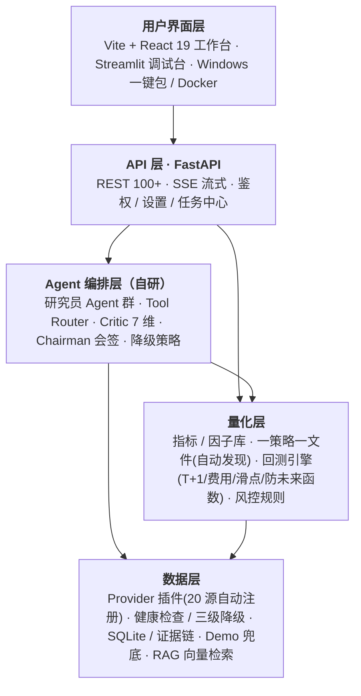

# Architecture (v1.9.x)

This document describes the system architecture and data flow of 研策中枢 AlphaScope — a local-first AI investment-research and quantitative decision workbench.

> 本文档随版本更新。上一版（v0.40）描述的是早期 Streamlit 形态，已与现状脱节；本文反映 **v1.9.x** 的分层架构（FastAPI 100+ 接口、自研多 Agent 编排、量化层独立、Provider 插件化）。

## System Overview



每一层独立可测、可替换。新增 Provider / 策略只需放一个文件（importlib 自动发现），无需改核心代码。

## Layer Details

### 1. 数据层 · Provider 插件 (`backend/providers/`)

20 个真实数据源 + 1 个 Demo 兜底，统一 `BaseProvider` 接口：

| Provider | 市场 | 数据类型 | 说明 |
|----------|------|----------|------|
| AkShare | CN | 全品类 | 主力源，已集成 1.18.60 |
| EastMoney | CN | 新闻/资金流 | 三级兜底之一 |
| BaoStock | CN | 价格兜底 | 三级兜底之一 |
| Tushare | CN | 报告/行情 | 需 Key |
| CNInfo | CN | 公告 | S 级信任 |
| CLS (财联社) | CN | 快讯 | A 级 |
| DragonTiger | CN | 龙虎榜/游资 | — |
| Northbound | CN | 北向资金流 | — |
| SEC EDGAR | US | Filings | S 级 |
| Finnhub | US | 新闻/行情 | — |
| HKEXnews | HK | 公告 | S 级 |
| OpenBB | Global | 行情/基本面 | — |
| FRED | Global | 宏观 | A 级 |
| Reddit / StockTwits | US | 舆情 | C 级 |
| Google Trends / Wikipedia Views | Global | 另类舆情 | C 级 |
| Web Search | Global | 检索补全 | — |
| **CSV Upload** | Any | 用户行情 | 上传 CSV/Excel→schema 自动发现→入查询面，标 `source=csv_upload` |
| **Demo** | — | 内置示例 | 零 Key 兜底，读 seed DB |

`ProviderRegistry` 负责 importlib 自动发现、优先级路由、`is_available()` 健康检查与失败 failover。价格取数走 **三级兜底**（AkShare → 东财 → 腾讯/BaoStock）。配置见 `config/data_sources.yaml`。健康状态经 `SourceHealthMonitor` 跟踪，可通过 `GET /api/providers/health` 查询。

> **v1.9.4 能力 schema 与质量分**：`BaseProvider.capability()` 用统一 schema 表达每个源的市场/数据类型/粒度/延迟/成本/速率/凭证/优先级/可降级（对标 tickflow tiers.yaml），经 `GET /api/providers/capabilities` 聚合透出。`observability/source_health.py` 的 `compute_quality_score()` 把健康度量化为 0–100 质量分（成功率 × 新鲜度 × 完整度）+ 红黄绿 grade，附加在 `/api/providers/health` 每个源上。`CsvUploadProvider`（`csv_provider.py`，priority=15）让用户上传自带行情零 Key 入回测/查询面，`discover_schema` 认中英文表头，数据明确标注 `user_upload` 绝不冒充在线源。

> Demo Provider (`demo_provider.py`)：`requires_key=False`、低优先级，读取打包的 `seed/ai_finance.db`（10 只股票真实价格），数据标记 `source=demo_seed`，让用户不配 Key 也能走完整路径。

### 2. 存储与证据层

- **SQLite** — 结构化存储：新闻、研报、公告、行情、证据项、来源抓取日志、回测运行记录等。写操作线程安全（mutex）。
- **Evidence Store** (`backend/evidence_store.py`) — 证据链 CRUD，每条证据带 `evidence_type / source_url / claim / confidence / symbols / data_date`。Agent 结论力求反链到具体 `evidence_id`，构成「可审计」核心。
- **RAG** (`backend/rag/`) — 6 个模块（chunker / document_pipeline / hybrid_retriever / retriever / vector_store），可选向量库做语义检索，把相关证据注入 Agent 上下文。
- **Report Archive** (`backend/archive.py` + `archive_tagger.py`) — 每次深度分析自动归档为 Markdown，含决策、置信度、模型组合快照、Critic 质量分，支持事后复盘。

### 3. Agent 编排层（自研）(`backend/runtime/` + `backend/agents/`)

- **Orchestrator** (`runtime/orchestrator.py`) — 调度核心，三种模式：
  - **Standard** — 少量 Agent + 单模型，快速。
  - **Deep** — 5 默认角色 Agent（基本面 / 技术面 / 情绪 / 风控 / 资金行为）+ Critic + Chairman，多模型异构。
  - **Auto** — Standard 预筛，置信度模糊（30–70%）时升级到 Deep。
- **Data Verifier** (`agents/data_verifier.py`，v1.9.4) — 在任何 LLM 调用**之前**做确定性数据完整性预检：逐维度核验行情/技术/基本面/资金流/舆情/证据是否齐全·新鲜·无异常，缺失维度打标后由 `brief_warning()` 生成「严禁编造」强约束注入简报，杜绝 Agent 对缺失数据脑补。纯规则、不触网、失败不阻断；结果经全路径透出 `data_verification`。
- **Tool Router** (`runtime/tool_router.py`) — Agent 工具调用路由。
- **Critic** (`critic.py`) — 对每个 Agent 输出做 **7 维评分**：证据质量 / 逻辑一致性 / 矛盾检测 / 缺失证据 / 过度自信标记 / 证据覆盖率 / 因子一致性。
- **Chairman** (`agents/chairman.py`) — `summarize_with_chairman()` 汇总多模型信号 + 置信度 + 理由，产出最终会签结论。
- **Expert Panel** — 可配置专家团（`config/experts.yaml`），5 种辩论模式（QUICK_VOTE / ROUNDTABLE / DEVILS_ADVOCATE / CHAIRMAN_RULING / HUMAN_INTERVENTION）。
- **降级策略** — 单 Agent 失败降级备用模型并标 `degraded=true`；全部失败时走 `demo_fallback`（无 Key）或返回结构化失败，**绝不返回伪造的"正常成功"**。

### 4. 量化层 (`backend/quant/`)

- **回测引擎** (`engine.py`) — 自研事件驱动引擎，主循环接入真实 A 股交易摩擦：
  - **防未来函数**：T 日信号于 **T+1 开盘价成交**（不再用当天 close 既算信号又成交），最后一根 bar 的信号无下一 bar 可成交则丢弃。
  - **T+1 结算**、**印花税（卖出单边）**、**滑点**、**涨跌停封板**（见 `constraints.py` 的 `T1Constraint` / `TradingCostModel` / `LimitUpDownFilter`）。
- **策略库** (`strategies/` 包) — 一策略一文件 + `StrategyRegistry` 自动发现，内置 9 个策略（MA / MACD / RSI / 布林突破 / 海龟 / 超跌反弹 / 动量TopN / 放量突破 / **低代码 custom_rule**）。`custom_rule`（v1.9.4）由前端「低代码策略编辑器」用「字段+操作符+阈值」可视化组合编译而来，复用同一回测引擎、不新建引擎。
- **指标** (`metrics.py`) — Sharpe / Sortino / Calmar / Profit Factor / 年化 / 最大回撤 / 胜率；v1.9.4 补**基准相对指标**（超额收益 / 信息比率 / Jensen's alpha / beta，对标 Qlib 口径，无基准时优雅降级）。
- **样本外走查** (`walk_forward.py`，v1.9.5) — 把历史切成顺序的 IS+OOS 窗口（`anchored` 锚定 / `rolling` 滚动），逐窗用同一固定参数策略回测，度量**时间稳健性**（收益是否跨区间一致，而非集中在某段运气）。每窗只跑一次引擎覆盖连续 IS+OOS 切片（指标有预热、无信号断层），再按权益曲线在分界处切分 OOS 重新归一；输出走查效率 WFE、样本外胜率、一致性评分与稳健性描述。纯确定性、失败安全、复用回测引擎，附「样本外≠未来」免责。`POST /api/quant/walk-forward`。
- **筹码分布** (`chip_distribution.py`，v1.9.6) — A 股成本分布:换手率扩散模型(老筹码按 1−t 衰减、新筹码按当日价格区间三角分布铺开,逐日累积),读出获利盘%/平均成本/70%-90% 集中度/上下方筹码密集价。优先用真实换手率,缺失退回量能代理(标 `model=volume_proxy`)。纯确定性、失败安全;描述历史成本结构,不预测价格。`POST /api/quant/chip-distribution`。
- **策略横向对比榜** (v1.9.7) — 同一标的一次取数、跑完全部内置策略并按指标(夏普/累计收益/Calmar 等)排名,复用同一回测引擎;模板策略 `custom_rule` 跳过。纯本地确定性,仅历史对比、不构成选股建议。`POST /api/quant/compare-strategies`。
- **实验记录持久化** (`experiment_store.py`，v1.9.8) — 把回测/走查/筹码/策略榜结果落 SQLite(独立表 `quant_experiments`,懒建表不改核心 schema),跨会话可查/调阅/横比;全失败安全(持久化失败不影响运行),`_prune` 保留最近 300 条。端点 `GET/DELETE /api/quant/experiments[/{run_id}]`、`POST /api/quant/experiments/compare`。与内存态 `_local_runs` 并存。
- **风控** — 双层职责分离：① 回测期 `risk_controller.py` 6 条硬规则逐 bar 拦截交易；② 决策期 `risk/engine.py`（v1.9.3）在研报发布前做独立一票否决 gate（黑名单/仓位/集中度/置信度门控，纯规则可单测），critical 触发则研报顶部红字否决、方向性结论不作为投资依据。
- **Portfolio** (`portfolio.py`) — 持仓与成本核算，`execute_buy/sell` 支持可选佣金/印花税参数。

### 5. 视觉/多模态 (`backend/vision/`)

图像 / K 线图分析带真实数据交叉验证：检测图表类型 → LLM 解读趋势/支撑阻力/形态 → 拉取真实 OHLCV → 视觉结论与真实数据比对，避免模型「自信地看图说话」。

### 6. API 层 (`backend/api/`)

FastAPI 提供 100+ REST / SSE 接口，按域拆分（`quant.py` / `analysis.py` / `news.py` / `evidence.py` / `settings.py` / `providers.py` 等）。SSE 流式用于 AI 对话与研报生成进度。回测响应透出 `assumptions` 字段，让「本次回测假设」对用户可见。

### 7. 用户界面层

- **`apps/web`** — Vite + React 19 + TypeScript 工作台，状态驱动 SPA（无 React Router），Sidebar 分两组（投研核心 / 量化研究引擎）约 15 个模块。SSE 流式对话、证据链反查、回测交易明细与免责声明、**低代码策略编辑器**（字段+操作符+阈值无代码组合信号）、**样本外走查 Tab**（IS/OOS 窗口稳健性体检，v1.9.5）已接入。
- **Streamlit 调试台** — 保留用于快速实验与诊断（非主交付形态）。
- **Windows 一键包** — PyInstaller + Inno Setup，首启自动生成 master key 做 AES-GCM 加密。

## Data Flow Example

```
用户选 600519 (贵州茅台)
    ↓
Provider 层取数: 新闻(CLS+AkShare) · 公告(CNInfo) · 行情(AkShare,三级兜底) · 资金流
    ↓
质量层: 去重 → 来源排序 → 跨源验证 → 异常检测
    ↓
存储: SQLite(结构化) + Evidence Store(证据) + RAG(向量索引)
    ↓
RAG 检索相关证据 + 因子生成器算 5 维分数, 注入 Agent 上下文
    ↓
数据核验(data_verifier): 逐维度预检, 缺失维度打标「严禁编造」注入简报
    ↓
5 Agent 并行分析(注入证据+因子) → Critic 7 维评分 → Chairman 会签
    ↓
研报生成(质量门控: 禁空话/覆盖率/矛盾呈现/免责, critical 不清零拒绝发布)
    ↓
前端展示 + 自动归档; 用户可一键回测(带真实摩擦) + 导出
```

## Thread Safety & 并发

- 共享状态用双重检查锁：Database 写操作 mutex、VectorStore collection 操作 mutex、Task Queue 串行化。
- async 路由解阻塞：长任务（资金流、模型列表）移入 worker thread + 超时，避免阻塞事件循环（见 v1.9.0 性能优化）。
- 关键路径有 TTL 缓存（如资金流），上游不可用时返回缓存并标 `degraded=true`。

## Configuration

| 文件 | 用途 | 热重载 |
|------|------|--------|
| `config/models.yaml` | 每个 Agent 的模型分配 | 是 |
| `config/data_sources.yaml` | Provider 优先级 / 超时 / 重试 | 是 |
| `config/experts.yaml` | 专家人设定义 | 否 |
| `config/agent_teams.yaml` | Agent 编队 / 辩论模式 | 是 |
| `.env` | API Key 与 Base URL（AES-GCM 加密存储） | 否 |

## Compliance

所有能力限定于「研究、回测、决策支持、可审计」范畴：**不荐股、不预测、不承诺收益、不接实盘 / 自动下单**。回测页与导出报告显著标注「回测结果不代表未来收益」。
