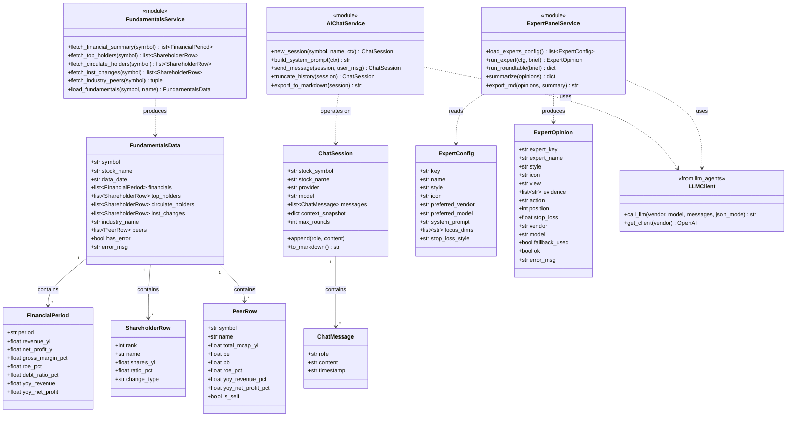
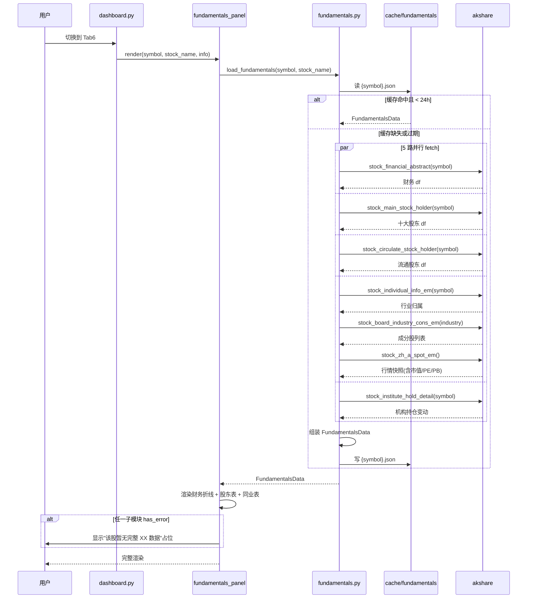
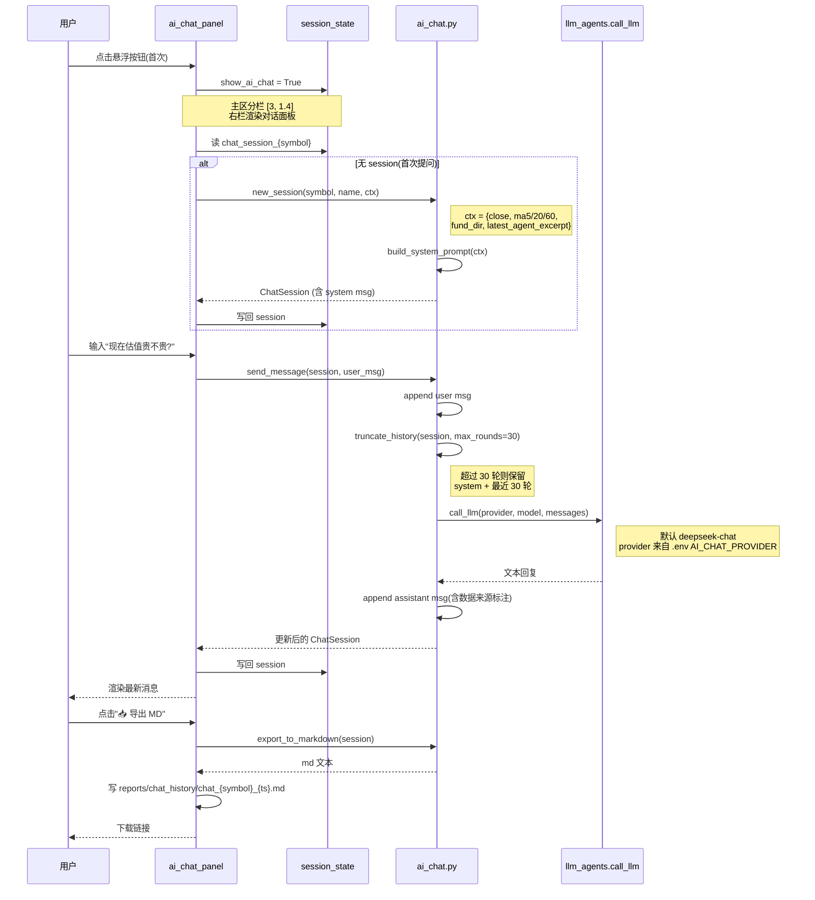
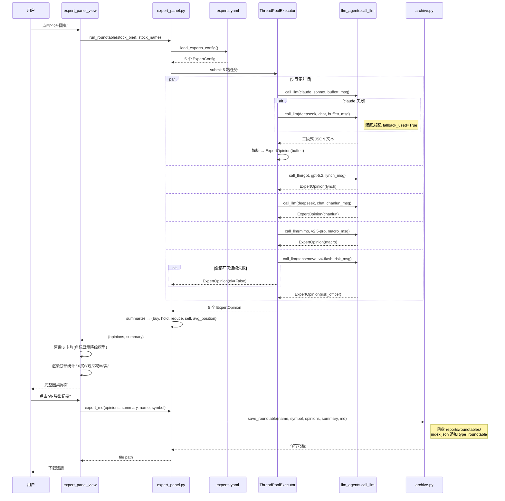
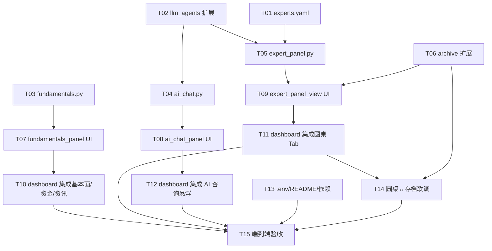

# AI-Finance v0.7 增量架构设计

> 编写人:Bob(架构师)
> 版本:v0.7 增量设计
> 上游输入:`reports/v0.7-PRD.md`(Alice 已确认)
> 主理人决策:① 专家团走现有兜底 + 角标"(降级模型)";② AI 咨询仅做 30 轮截断;③ 同业龙头按行业总市值前 8
> 适用范围:**仅描述 v0.6 → v0.7 的增量**,不重复已实现的能力

---

## 章节 1 · 实现方案与框架选型

### 1.1 总体策略

v0.7 是一次**信息维度 + 交互能力**双扩展。三大新能力(信息丰富化 / AI 咨询 / 专家圆桌)彼此**正交**,共用同一份 LLM 客户端层与同一份股票上下文,但**不共享业务模型**——这是模块拆分的关键。

| 子系统 | 关注点 | 与 v0.6 的关系 |
|---|---|---|
| **信息丰富化(基本面)** | 静态数据展示 | 扩展现有 Tab6,新增 `backend/fundamentals.py` 数据层 |
| **AI 咨询** | 多轮对话 + 上下文注入 | 全新功能,新增 `backend/ai_chat.py` |
| **专家团圆桌** | 投顾视角并行调用 | 与 `llm_agents.py`(分析师视角)**职能解耦**,新增 `backend/expert_panel.py` |

### 1.2 模块拆分原则

**后端**采用「数据层 + 服务层」两层设计,服务层全部为函数式 API(避免不必要的类抽象);**前端**沿用 Streamlit 编排模式,但**抽出新功能到 `frontend/components/`**——主文件 `dashboard.py` 只做 Tab 编排与状态分发,不再承担业务渲染。

| 模块 | 类型 | 选型理由 |
|---|---|---|
| `backend/fundamentals.py` | 新建独立模块 | 财务/股东/同业三类数据**逻辑独立**,内聚到一起;若并入 `news_data.py` 会破坏其"资讯/研报"语义 |
| `backend/ai_chat.py` | 新建 | 会话状态、上下文注入、历史截断属于**对话域**,与现有 Agent 工作流(单轮独立推理)完全不同 |
| `backend/expert_panel.py` | 新建,与 `llm_agents.py` **解耦** | `llm_agents` 是**职能型分析师**(基本面/技术/舆情/风控/散户),`expert_panel` 是**风格型投顾**(巴菲特派/林奇派/缠论派/宏观/风控官);二者复用 LLM 客户端但**不共享 prompt 与决策规则** |
| `config/experts.yaml` | 新建配置 | 5 位专家人设、推荐模型、关注维度走配置文件,符合 PRD P0-11 |
| `frontend/components/` | 新建包 | 抽出 3 个新功能各自的 UI 渲染逻辑,主文件 `dashboard.py` 从 1982 行的"上帝文件"瘦身为编排层(预计降至 ~1500 行)|

### 1.3 复用现有基础设施(避免重复造轮子)

| 复用点 | 现有位置 | 新模块的复用方式 |
|---|---|---|
| LLM 客户端缓存 | `llm_agents.get_client(vendor)` | `expert_panel.py` / `ai_chat.py` 直接 `import get_client` |
| LLM 调用统一接口 | `llm_agents._call_with()` | 重命名暴露为 `call_llm()`(保留 `_call_with` 别名兼容) |
| 双层兜底逻辑 | `llm_agents.run_one_agent()` 内部 for-loop | 复用同款 `[(主, 主模型), FALLBACK_VENDOR_MODEL]` 模式 |
| 厂商配置 | `llm_agents.VENDORS` 字典 | 扩展 1 个新厂商 `kimi`(.env 已配,但 v0.6 未注册)以支持 AI 咨询切换 |
| Streamlit 缓存 | `@st.cache_data(ttl=...)` | 同款装饰器:`@st.cache_data(ttl=86400)` 用于 fundamentals(24h);`ttl=300` 用于资金流细分 |
| 研究存档 | `archive.save_report()` + `index.json` | 圆桌纪要走 `archive.save_roundtable()` 新接口,索引追加 `type: roundtable` 字段以兼容 |
| 错误处理模式 | `news_data._safe(fn, ...)` 包装 | `fundamentals.py` 沿用 `_safe()` 模式,akshare 调用全部包装 |

### 1.4 关键技术难点

1. **AI 咨询的"伪悬浮"侧滑面板**:Streamlit 原生不支持悬浮元素,采用「**主区动态分栏 + CSS 固定按钮**」方案——
   - CSS `position: fixed; bottom: 24px; right: 24px;` 渲染浮动按钮
   - 点击按钮翻转 `st.session_state.show_ai_chat`
   - 启用时主区从 `st.container()` 改为 `st.columns([3, 1.4])`,右栏(~400px)即对话面板
   - 兼容性优于 `st.dialog`(无法保持开启)与 `st.sidebar`(已被股票选择占用)

2. **专家圆桌 5 路并行调用**:沿用 `llm_agents.run_all_agents()` 的 `ThreadPoolExecutor` 模式,但**单专家失败必须不阻塞其他**——返回 `ExpertOpinion(ok=False, error=...)` 卡片,由 UI 展示为"该专家暂不可用",符合 PRD P0-12。

3. **同业对比龙头筛选**:`stock_board_industry_cons_em` 返回的成分股**不含市值列**,需要二次关联——
   - 步骤一:`stock_individual_info_em(symbol)` 取所属行业名
   - 步骤二:`stock_board_industry_cons_em(industry)` 取行业全部成分代码
   - 步骤三:对成分代码批量调 `stock_zh_a_spot_em()` 取最新市值/PE/PB
   - 步骤四:按总市值降序取前 8(含本股),本股标记 `is_self=True`

4. **AI 咨询上下文注入**:`build_system_prompt()` 必须**实时拼接**最新价、5 日 K 线摘要、主力方向、最新一份归档报告摘要(若有)——首次提问时构建一次,后续追问复用同一 system prompt 不再重新拼接(避免上下文漂移)。

### 1.5 架构模式

- **后端**:函数式服务模块 + dataclass 数据容器,无 ORM、无类继承
- **前端**:Streamlit MVC 简化版——`dashboard.py` 是 Controller,`components/*.py` 是 View,`backend/*.py` 是 Model
- **状态**:Streamlit `session_state` 作为前端状态唯一来源,后端**无状态**(stateless),便于测试

---

## 章节 2 · 文件列表

### 2.1 新增文件(8 个)

| 路径 | 类型 | 主要职责 |
|---|---|---|
| `config/experts.yaml` | 配置 | 5 位专家人设、推荐厂商/模型、关注维度、止损偏好 |
| `backend/fundamentals.py` | 后端服务 | 财务摘要 / 股东 / 同业对比的数据层 + 24h 文件缓存 |
| `backend/ai_chat.py` | 后端服务 | ChatSession 状态、上下文注入、LLM 调用、30 轮截断、Markdown 导出 |
| `backend/expert_panel.py` | 后端服务 | 5 专家并行调用、三段式 JSON 解析、投票统计、Markdown 纪要 |
| `frontend/components/__init__.py` | 包初始化 | 空文件,标识 `components` 为 Python 包 |
| `frontend/components/fundamentals_panel.py` | UI 组件 | "💡基本面"Tab 的全部新增渲染(财务折线 / 股东表 / 同业对比) |
| `frontend/components/ai_chat_panel.py` | UI 组件 | AI 咨询侧滑面板(消息流 / 输入框 / 引导按钮 / 导出) |
| `frontend/components/expert_panel_view.py` | UI 组件 | 5 卡片横排、点击展开、底部投票汇总、纪要导出 |

### 2.2 修改文件(4 个)

| 路径 | 修改点 |
|---|---|
| `frontend/dashboard.py` | ① L20 附近新增 `from components import fundamentals_panel, ai_chat_panel, expert_panel_view` 等 import<br>② L73 起 CSS 块**追加**:浮动按钮样式 / 专家卡片样式 / 时间轴节点样式<br>③ L614 `st.tabs([...])` 添加新 Tab "🎓 专家团圆桌",变为 8 Tab<br>④ L1200(Tab3 资讯研报)顶部**插入**「时间轴 / 分类」`st.radio` 视图切换器,时间轴模式下合并三源最近 10 条按时间倒序<br>⑤ L1370(Tab4 资金流向)在现有图表**之后追加**:超大/大/中/小单饼图 + 5 日趋势柱图 + 主力进出场判定文字<br>⑥ L1610(Tab6 基本面)**整体替换**为 `fundamentals_panel.render(symbol, stock_name, info)` 单行调用<br>⑦ L1627(Tab7 研究存档)**之后**追加 `with tab8: expert_panel_view.render(symbol, stock_name, ...)` <br>⑧ 主区域顶层(L457 标题之后)**插入**浮动按钮 HTML + 主区分栏判断逻辑,启用 AI 咨询时调用 `ai_chat_panel.render(symbol, stock_name, stock_brief)` |
| `backend/archive.py` | ① `save_report()` 增加可选参数 `report_type: str = "agent"`,写入 `meta["type"]`<br>② **新增** `save_roundtable(stock_name, symbol, opinions, summary, md_text)` 函数,落盘到 `reports/roundtables/{symbol}/`,索引追加 `type: "roundtable"`<br>③ `list_reports()` 增加可选参数 `type_filter: str = None` |
| `backend/llm_agents.py` | ① `_call_with` **新增公共别名** `call_llm = _call_with`(不破坏现有调用)<br>② `VENDORS` 字典**追加** `kimi` 厂商(供 AI 咨询切换),从 `KIMI_API_KEY`/`KIMI_BASE_URL` 读取<br>③ 不修改 5 Agent 模型映射,保持向后兼容 |
| `.env` | **追加**两行配置说明(注释形式):<br>`# AI 咨询默认厂商,支持 deepseek/kimi/claude/gpt`<br>`AI_CHAT_PROVIDER=deepseek` |

### 2.3 新增数据/产物目录(运行时自动创建)

| 路径 | 用途 |
|---|---|
| `cache/fundamentals/{symbol}.json` | 财务/股东/同业 24h 缓存(P1-1) |
| `reports/chat_history/{stock_code}_{ts}.md` | AI 咨询导出(P0-10) |
| `reports/roundtables/{symbol}/{ts}-{name}.md` | 专家圆桌纪要(P0-14) |

---

## 章节 3 · 数据结构和接口(类图)



### 3.1 关键函数签名

```python
# backend/fundamentals.py
def load_fundamentals(symbol: str, stock_name: str) -> FundamentalsData:
    """单次入口,内部串联 5 个 fetch + 24h 缓存。任一 fetch 失败不影响其他子模块"""

def fetch_financial_summary(symbol: str, periods: int = 4) -> list:
    """近 N 期财报核心指标。失败返回 []"""

def fetch_industry_peers(symbol: str, top_k: int = 8) -> tuple:
    """返回 (industry_name, list[PeerRow])。按总市值降序前 K,本股标记 is_self=True"""

# backend/ai_chat.py
def new_session(symbol: str, stock_name: str, ctx: dict) -> ChatSession:
    """ctx 字典含 close, ma_summary, fund_dir, latest_archive_excerpt 等"""

def send_message(session: ChatSession, user_msg: str) -> ChatSession:
    """append user → truncate(30) → call_llm → append assistant。返回更新后的 session"""

def export_to_markdown(session: ChatSession) -> str:
    """生成 Markdown 文本,前端写文件并提供下载"""

# backend/expert_panel.py
def run_roundtable(stock_brief: str, stock_name: str) -> dict:
    """返回 {opinions: dict[expert_key→ExpertOpinion], summary: {buy, hold, reduce, sell, avg_position}}"""

def export_md(opinions: dict, summary: dict, stock_name: str, symbol: str) -> str:
    """三段式纪要,自动归档到 reports/roundtables/"""
```

### 3.2 配置文件结构(`config/experts.yaml`)

```yaml
# 5 位专家人设。fallback 默认走 deepseek(与 v0.6 一致)
experts:
  - key: buffett
    name: 巴菲特派
    style: 价值投资
    icon: "🎩"
    preferred_vendor: claude
    preferred_model: claude-sonnet-4-5
    focus_dims: [护城河, ROE, 估值, 长期持有]
    stop_loss_style: 宽松
    system_prompt: |
      你是巴菲特派价值投资专家。坚持"以合理价格买入伟大公司,长期持有"。
      你只在估值明显低估或基本面恶化时建议交易。止损偏宽松,允许 -15% 浮亏。

  - key: lynch
    name: 林奇派
    style: 成长投资
    icon: "🌱"
    preferred_vendor: gpt
    preferred_model: gpt-5.2
    focus_dims: [营收增速, PEG, 行业景气, 业务可理解性]
    stop_loss_style: 中等

  - key: chanlun
    name: 缠论派
    style: 技术分析
    icon: "📐"
    preferred_vendor: deepseek
    preferred_model: deepseek-chat
    focus_dims: [中枢, 背驰, 走势级别, 量价配合]
    stop_loss_style: 严格

  - key: macro
    name: 宏观官
    style: 自上而下
    icon: "🌐"
    preferred_vendor: mimo
    preferred_model: mimo-v2.5-pro
    focus_dims: [流动性, 政策风向, 行业景气度, 海外联动]
    stop_loss_style: 中等

  - key: risk_officer
    name: 风控官
    style: 风险优先
    icon: "🛡️"
    preferred_vendor: sensenova
    preferred_model: deepseek-v4-flash
    focus_dims: [波动率, 回撤, 流动性, 主力撤离信号]
    stop_loss_style: 极严格

# 公共要求(注入每个专家的 user message 末尾)
output_schema: |
  必须严格按以下 JSON 返回,不要有任何前后说明:
  {
    "view": "核心观点(1-2 句)",
    "evidence": ["关键依据1", "关键依据2", "关键依据3"],
    "action": "买入|观望|减持|卖出",
    "position": 30,
    "stop_loss": 1500.0
  }
```

---

## 章节 4 · 程序调用流程(时序图)

### 4.1 流程一:用户进入"💡基本面"Tab



### 4.2 流程二:用户在 AI 咨询输入框发问



### 4.3 流程三:用户点击"召开圆桌"



---

## 章节 5 · 任务列表

> 字段说明:`task_id` / `subject` / `产出物`(主要交付文件) / `依赖`(前置 task_id) / `验收点`(可手测的标准)
>
> 工程师按 task_id 顺序实现。每完成一个 task,运行其验收点确认通过后再进入下一个。

| task_id | subject | 产出物 | 依赖 | 验收点 |
|---|---|---|---|---|
| **T01** | 创建专家人设配置文件 | `config/experts.yaml`(5 位专家完整人设) | — | 文件存在;`yaml.safe_load` 解析无报错;5 个专家 key 齐全;每位专家有 `system_prompt`/`preferred_vendor`/`preferred_model`/`focus_dims` 字段 |
| **T02** | 扩展 LLM 客户端层(暴露公共调用接口 + 注册 kimi) | 修改 `backend/llm_agents.py`:① `call_llm = _call_with` 别名;② `VENDORS["kimi"]` 配置 | — | `from llm_agents import call_llm, VENDORS, get_client` 可用;`VENDORS` 含 kimi;原有 5 Agent 测试 `python backend/test_archive_e2e.py` 仍然通过 |
| **T03** | 创建 fundamentals 数据层 | `backend/fundamentals.py`(5 个 fetch 函数 + `load_fundamentals` + 24h 文件缓存 + dataclass `FundamentalsData`/`FinancialPeriod`/`ShareholderRow`/`PeerRow`) | — | 命令行测试 `python backend/fundamentals.py 600519` 输出 4 期财报、十大股东、行业(白酒)+ 8 家龙头(含本股);二次运行 < 1s(走缓存);文件 `cache/fundamentals/600519.json` 存在 |
| **T04** | 创建 AI 咨询服务层 | `backend/ai_chat.py`(dataclass `ChatSession`/`ChatMessage` + 5 个公共函数) | T02 | 单元自测:① `new_session` 生成的 session 含 system message;② 模拟 35 轮对话后 `truncate_history` 仅保留 system + 最近 30 轮;③ `export_to_markdown` 输出可读 Markdown;④ 切换 `AI_CHAT_PROVIDER` 后 `send_message` 实际调用对应厂商 |
| **T05** | 创建专家圆桌服务层 | `backend/expert_panel.py`(dataclass `ExpertConfig`/`ExpertOpinion` + `load_experts_config`/`run_expert`/`run_roundtable`/`summarize`/`export_md`) | T01, T02 | 命令行测试 `python backend/expert_panel.py 600519` 输出 5 张专家观点(允许部分降级);单专家失败不阻塞其他;返回的 summary 含 buy/hold/reduce/sell/avg_position;总耗时 ≤ 15 秒(PRD P0-12) |
| **T06** | 扩展 archive 支持圆桌纪要 | 修改 `backend/archive.py`:① `save_report(report_type="agent")` 增加 type 字段;② 新增 `save_roundtable()`;③ `list_reports(type_filter=...)` | — | 调用 `save_roundtable("贵州茅台", "600519", opinions, summary, md)` 后,`reports/roundtables/600519/` 出现 .md 文件,`index.json` 出现 `type: "roundtable"` 记录;`list_reports(type_filter="roundtable")` 仅返回圆桌记录;原有 agent 类型记录不受影响 |
| **T07** | 创建前端组件包 + 基本面面板 | `frontend/components/__init__.py`(空)、`frontend/components/fundamentals_panel.py`(`render(symbol, stock_name, info)` 单一入口) | T03 | 在 dashboard 中临时调用 `fundamentals_panel.render(...)` 后,Tab 内出现:① 4 期财务折线/柱图;② 十大股东 + 流通股东 + 机构持仓变动 3 张表;③ 行业 + 8 家龙头对比表(本股加粗高亮);④ 任一数据源失败时显示 "该股暂无完整 XX 数据" 占位文字 |
| **T08** | 创建 AI 咨询面板组件 | `frontend/components/ai_chat_panel.py`(`render(symbol, stock_name, ctx)` + 引导按钮、输入框、消息流、清空、导出) | T04 | 集成后:① 输入"估值如何"返回带数据依据的回答;② 点击引导按钮自动填入并发送;③ 关闭面板再打开历史保留;④ 点击"📥导出"产生 `reports/chat_history/chat_600519_{ts}.md`;⑤ 未选股时显示"请先选择股票"并禁用输入 |
| **T09** | 创建专家圆桌视图组件 | `frontend/components/expert_panel_view.py`(`render(symbol, stock_name, stock_brief)` + 召开按钮、5 卡片、展开折叠、底部统计、纪要导出) | T05, T06 | 点击"召开圆桌"后:① 5 张卡片横排,每张含 view/action/position/止损位/降级模型角标(若 fallback_used);② 卡片可点击展开显示 evidence 列表;③ 底部统计"X买/Y观/Z减/W卖 平均仓位 X%";④ 点击"📥导出纪要" 生成 `reports/roundtables/600519/{ts}-贵州茅台.md` 并写入 archive 索引 |
| **T10** | dashboard 集成基本面 + 资金流细分 + 资讯时间轴 | 修改 `frontend/dashboard.py`:① 顶部 import components 三模块;② Tab6 整体替换为 `fundamentals_panel.render(...)`;③ Tab4 在现有图表后追加 4 类资金饼图 + 5 日趋势 + 主力进出场判定文字(规则:超大单近 5 日净流入 > 5000 万 → "主力进场");④ Tab3 顶部增加`st.radio("视图", ["📅 时间轴", "📂 分类"])`,时间轴模式合并三源最近 10 条按时间倒序 | T07 | 启动 `streamlit run` 访问看板:① Tab6 完整呈现新基本面;② Tab4 现有内容不变,下方新增 4 类资金饼图 + 5 日柱图 + 一行判定;③ Tab3 顶部出现切换器,时间轴模式下新闻按时间倒序合并显示 |
| **T11** | dashboard 集成专家圆桌 Tab | 修改 `frontend/dashboard.py`:① L614 `st.tabs(...)` 末尾追加 "🎓 专家团圆桌";② 文件末尾追加 `with tab8: expert_panel_view.render(symbol, stock_name, stock_brief)`;③ `stock_brief` 复用 `llm_agents.build_market_brief()` 输出 | T09 | 看板显示 8 个 Tab,最后一个为"🎓 专家团圆桌";切到该 Tab 显示"召开圆桌"按钮,点击后正常运行;切换股票后再次点击,卡片刷新为新股票 |
| **T12** | dashboard 集成 AI 咨询悬浮面板 | 修改 `frontend/dashboard.py`:① CSS 块追加浮动按钮样式(position:fixed; bottom:24px; right:24px);② L457 标题之后插入浮动按钮 HTML;③ 点击切换 `st.session_state.show_ai_chat`;④ 主区从单容器改为条件分栏 `st.columns([3, 1.4])`,启用时右栏调用 `ai_chat_panel.render(symbol, stock_name, ctx)`;⑤ `ctx` 通过新函数 `build_chat_context()` 拼接最新价/MA 摘要/主力方向/最新归档报告摘要 | T08 | 任意 Tab 浏览时:① 右下角始终显示"🤖 AI 咨询"按钮;② 点击后主区压缩,右侧出现 400px 对话面板;③ 切换 Tab 不丢失会话;④ 切换股票自动新建会话(旧 session 保留在 session_state) |
| **T13** | .env 与依赖声明更新 | ① `.env` 追加 `AI_CHAT_PROVIDER=deepseek` 注释行;② 更新 `README.md` 增加 v0.7 新模块/新依赖说明;③ 在 `requirements.txt` 增加 `pyyaml>=6.0`(若文件不存在则在 README 中标注 pip install 命令) | — | `pip install pyyaml` 完成后 `python -c "import yaml"` 正常;.env 注释清晰;README 更新版本号到 v0.7 并列出新增 Tab/模块 |
| **T14** | 端到端联调:专家圆桌 ↔ 研究存档 | 圆桌纪要落盘后,在 Tab7"📚研究存档"中可见 `type=roundtable` 的记录;点击"查看"能加载 .md 全文 | T11, T06 | ① 在 Tab8 触发圆桌并导出;② 切到 Tab7 可见新增记录(决策列显示"圆桌纪要");③ 索引筛选支持 type 过滤;④ 点击行打开 Markdown 全文 |
| **T15** | 全链路验收 + 回归测试 | 运行所有 v0.6 现有测试(`test_archive_e2e.py` 等)通过;新增简单 smoke test:① fundamentals.py 命令行可跑;② expert_panel.py 命令行可跑;③ 看板 8 Tab 全部可访问无报错 | T10, T11, T12, T13, T14 | ① v0.6 全部测试 PASS;② 新功能演示:贵州茅台 600519 一次跑通——基本面有数据 / AI 咨询能多轮对话 / 圆桌 5 卡呈现 / 资金流细分饼图正常 / 时间轴新闻倒序;③ 切换到东方财富 300059 验证非白酒行业的同业对比也能正常出图;④ 切到一个数据稀疏的股票验证占位提示正确显示 |

### 5.1 任务依赖图



### 5.2 任务粒度说明(给主理人)

按主理人要求 14-20 个任务,本设计共 **15 个任务**。可以从 5 个逻辑簇视角理解:

| 逻辑簇 | 任务 | 备注 |
|---|---|---|
| 配置/基础 | T01, T02, T13 | 配置文件 + LLM 客户端层扩展 + 依赖声明 |
| 后端服务层 | T03, T04, T05, T06 | 三个新模块 + archive 扩展 |
| 前端 UI 组件 | T07, T08, T09 | 三个 components 子模块 |
| 主文件集成 | T10, T11, T12 | dashboard.py 三块修改(基本面+资金+资讯 / 圆桌 Tab / AI 咨询悬浮) |
| 联调验收 | T14, T15 | 跨模块联调 + 全链路回归 |

T01 / T02 / T03 / T06 / T13 之间**无依赖**,可并行启动。前端集成(T10/T11/T12)依赖各自的 components,互相不依赖,也可并行。

---

## 章节 6 · 依赖包列表

| 包 | 版本要求 | 用途 | 是否必装 |
|---|---|---|---|
| `pyyaml` | `>=6.0` | 解析 `config/experts.yaml` | ✅ 必装(v0.6 未装) |

**安装命令**:
```bash
python -m pip install "pyyaml>=6.0"
```

**评估过但不引入的依赖**:

| 包 | 拒绝理由 |
|---|---|
| `streamlit-chat` | 只是消息气泡组件,自定义 HTML/CSS 即可达成;引入会增加版本兼容风险 |
| `streamlit-extras` | 浮动按钮自己写 CSS 即可,避免重复包袱 |
| `pydantic` | 用 `dataclasses` 已足够,不引入新数据校验框架 |

---

## 章节 7 · 共享知识(跨文件约定)

### 7.1 LLM 调用统一规范

**所有新模块统一通过 `from llm_agents import call_llm, VENDORS, get_client`**——不要新封装客户端。

```python
# 正确示范(expert_panel.py / ai_chat.py)
from llm_agents import call_llm, VENDORS, FALLBACK_VENDOR_MODEL

text = call_llm(
    vendor="claude",
    model="claude-sonnet-4-5",
    messages=[{"role": "system", "content": "..."}, ...],
    json_mode=False,
    max_tokens=600,
    temperature=0.3,
)
```

**双层兜底也复用同款模式**(参考 `llm_agents.run_one_agent` L279):

```python
for vd, md in [(primary_vendor, primary_model), FALLBACK_VENDOR_MODEL]:
    try:
        text = call_llm(vd, md, messages, ...)
        # 成功
        fallback_used = (vd != primary_vendor)
        break
    except Exception as e:
        last_err = str(e)
        continue
```

### 7.2 akshare 错误处理统一规范

所有 akshare 调用必须经过 `_safe()` 包装(参考 `news_data.py` L19):

```python
def _safe(fn, *args, **kwargs):
    try:
        return fn(*args, **kwargs)
    except Exception:
        return None
```

**前端组件统一识别 None / 空 list / `has_error=True`**,显示占位文字(参考 PRD P0-1):

```python
if data.has_error or not data.financials:
    st.info("该股暂无完整财报")
```

### 7.3 session_state key 命名规范

避免冲突,统一前缀分配:

| 前缀 | 用途 | 示例 |
|---|---|---|
| `chat_session_{symbol}` | AI 咨询会话状态 | `chat_session_600519` |
| `show_ai_chat` | 全局浮动面板开关 | bool |
| `chat_provider_override` | 临时覆盖 .env 厂商 | str |
| `roundtable_{symbol}` | 最近一次圆桌结果(下次进 Tab8 直接显示) | dict |
| `roundtable_in_progress` | 圆桌运行中标志(防止重复点击) | bool |
| `news_view_mode` | Tab3 视图切换 | "timeline" / "category" |
| `fund_view_subtab` | Tab4 当前 subtab(预留) | str |

**禁止**:① 使用无前缀的短 key(如 `result`/`data`);② 跨 symbol 共用同一 key 而不带 symbol 后缀。

### 7.4 数据展示约定

| 项 | 约定 |
|---|---|
| 金额单位 | 默认"亿元",保留 2 位小数;< 1 亿用"万元" |
| 涨跌色 | **红涨绿跌**(A 股惯例),与 v0.6 现有 CSS 一致(`#ef5350` / `#26a69a`) |
| 占位文字 | 不显示空表格,统一 `st.info("该股暂无完整 XX 数据")` |
| 数据日期标注 | AI 咨询回答末尾必须含 `数据来自 akshare YYYY-MM-DD`(P1-3),由 system prompt 显式要求 |
| 缓存 TTL | fundamentals 24h(86400s);AI 咨询不缓存;资金流细分 5min(沿用 v0.6) |

### 7.5 文件路径约定

| 类别 | 根目录 | 命名规则 |
|---|---|---|
| 数据缓存 | `cache/fundamentals/` | `{symbol}.json` |
| AI 咨询导出 | `reports/chat_history/` | `chat_{symbol}_{YYYYMMDD-HHMMSS}.md` |
| 圆桌纪要 | `reports/roundtables/{symbol}/` | `{YYYYMMDD-HHMMSS}-{stock_name}.md` |

所有运行时路径从仓库根目录派生,目录不存在时自动 `mkdir(parents=True, exist_ok=True)`。

### 7.6 三段式 JSON 解析

复用 `llm_agents._extract_json()`(L221):

```python
from llm_agents import _extract_json
data = _extract_json(llm_text)
# data 内可能含 view, evidence, action, position, stop_loss 五字段
```

字段缺失时用合理默认值(`view=""`/`evidence=[]`/`action="观望"`/`position=0`/`stop_loss=None`),不要 raise。

---

## 章节 8 · 待明确事项

| # | 事项 | 我的建议方案 | 影响范围 |
|---|---|---|---|
| 1 | **AI 咨询面板的 Streamlit 实现**:PRD 推荐"右下角悬浮 + 侧滑",但 Streamlit 原生不支持。本设计采用「**CSS 固定按钮 + 主区动态分栏**」方案(主区 `st.columns([3, 1.4])`,启用时右栏即面板)。该方案会**压缩主区内容空间约 30%**——是否接受这个权衡? | **接受**:这是 Streamlit 生态下最稳妥的方案。其他方案(`st.dialog` / `st.sidebar`)各有更大缺陷。如果未来想真正做悬浮,需要引入 streamlit 自定义组件(成本远高于 v0.7 预算)。 | T12 实现 |
| 2 | **AI 咨询切换 Kimi**:.env 已有 `KIMI_API_KEY`/`KIMI_BASE_URL`,但 v0.6 的 `VENDORS` 字典里没有 kimi。本设计在 T02 中**注册 kimi 为新厂商**(供 AI 咨询使用,不进入 5 Agent 模型映射)。是否同意? | **同意**:不影响 v0.6 行为,只是为 P0-8(模型可切换)服务。Kimi 在新闻/对话场景表现良好,适合 AI 咨询。 | T02 实现 |
| 3 | **专家止损价取值**:LLM 直接在 JSON 输出 `stop_loss` 数值,还是后端基于技术位/ATR 计算? | **LLM 直接输出**:专家本身就要带止损偏好(yaml 中已配 `stop_loss_style`),让 LLM 在 system_prompt 引导下输出符合其风格的止损价更自然。后端只做合法性校验(数值/区间) | T01 + T05 |
| 4 | **同业对比的"龙头"细节**:行业总市值前 8 包含本股,如果本股不在行业前 8 怎么办? | **本股始终保留**,即"前 8 + 本股"最多 9 行,本股加粗高亮并标注"(当前股票)"。否则用户会困惑"为什么我选的股不在表里" | T03 + T07 |
| 5 | **AI 咨询的"最新归档报告摘要"注入**:如果当前股票从未做过 LLM 深度分析,context 里这一项为空。是否需要降级提示? | **降级提示**:system_prompt 中改为"暂无最新 Agent 报告,请基于价格/资金面回答"。不强制依赖归档存在。 | T04 实现 |
| 6 | **专家圆桌 Tab8 的位置**:加在 Tab7 之后(末尾),还是 Tab2 之后(与 Agent 相邻)? | **末尾(Tab8)**:专家团是新增能力,与最末的"研究存档"语义连贯("分析 → 决策 → 沉淀"),且 Tab2 的"Agent 协作"已经很重,旁边再加专家团会让导航视觉过载 | T11 实现 |

> 以上 6 项均已给出建议方案,工程师可按建议实施。如有不同意见请在开工前回复确认。

---

## 附录 A · v0.6 → v0.7 看板 Tab 演进对照

| Tab# | v0.6 名称 | v0.7 变更 |
|---|---|---|
| 1 | 📈 K 线 & 技术指标 | 不变 |
| 2 | 🤖 Agent 协作分析 | 不变(职能型 Agent,与专家团解耦) |
| 3 | 📰 资讯 & 研报 | **顶部**新增"时间轴 / 分类"切换器(P0-5) |
| 4 | 💰 资金流向 | **底部追加** 4 类资金饼图 + 5 日柱图 + 主力进出场判定文字(P0-4) |
| 5 | 📋 数据明细 | 不变 |
| 6 | 💡 基本面 | **整体重构**:在原有信息卡片下追加财务摘要 / 股东结构 / 同业对比三大区块(P0-1/2/3) |
| 7 | 📚 研究存档 | 索引支持 `type` 字段筛选(P1-2) |
| **8** | 🆕 **🎓 专家团圆桌** | **新增 Tab**:5 专家并行 + 三段式 JSON + 卡片展开 + 纪要导出(P0-11~14) |
| 浮动 | — | 🆕 右下角"🤖 AI 咨询"悬浮按钮 + 侧滑面板(P0-6~10) |

---

## 附录 B · 估算工作量(供主理人参考)

| 阶段 | 任务 | 估时 |
|---|---|---|
| 配置/基础层 | T01 / T02 / T13 | 1 人日 |
| 后端服务层 | T03 / T04 / T05 / T06 | 2 人日 |
| 前端组件层 | T07 / T08 / T09 | 1.5 人日 |
| dashboard 集成 | T10 / T11 / T12 | 1.5 人日 |
| 联调验收 | T14 / T15 | 0.5 人日 |
| **合计** | | **6.5 人日** |

> 文档结束。下一步移交工程师按 task_id 顺序实施。
